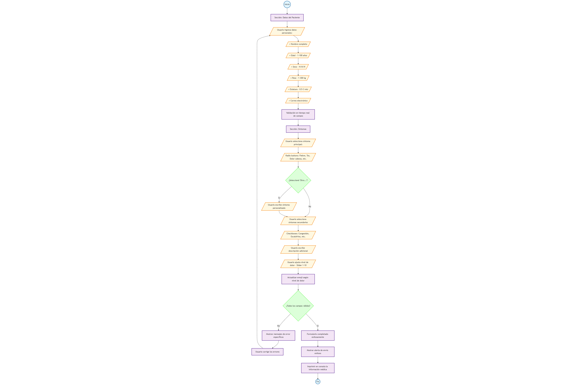

# Challenge ROMI

Este es el resultado del reto propuesto por ROMI, conforme a los requerimientos tome la idea de hacer un **formulario** medico con distintas opciones para adquirir mas informacion del usuario,
la interfaz es **responsiva** y simula un "envio" de datos pero en realidad por el momento no hace nada mas que validar las entradas del formulario, por ultimo, contiene animaciones de entrada y retroalimentacion
para el usuario.

## Arquitectura del proyecto

El proyecto sigue una estructura organizada en carpetas para separar responsabilidades y facilitar el mantenimiento del código.

```text
app/            # Componente principal de la aplicación
components/     # Conjunto de componentes reutilizables
┣ errors/       # Componentes relacionados con manejo y visualización de errores
┣ form/         # Componentes relacionados con el formulario
┣ header/       # Componentes del encabezado
┗ index.ts      # Archivo de barril para exportar componentes desde la carpeta
interfaces/     # Tipados
┣ form.interface.ts # Tipado específico para el formulario
┗ index.ts      # Archivo de barril para exportar interfaces
```

## Explicación breve

-   **app/**: Contiene el componente principal que actúa como punto de entrada de la aplicación.
-   **components/**: Centraliza todos los componentes reutilizables. Cada subcarpeta agrupa componentes relacionados con un propósito específico (errores, formularios, encabezado). Se incluye un archivo de barril para facilitar las importaciones.
-   **interfaces/**: Define los tipos de datos y contratos del proyecto, asegurando consistencia y tipado estricto en los formularios y otros módulos.

## Tecnologías usadas

-   **React**: Libreria principal para construir la interfaz de usuario.
-   **TypeScript**: Proporciona tipado estatico y mayor seguridad en el desarrollo.
-   **TailwindCSS**: Framework para estilizar componentes de manera rápida.
-   **Framer Motion**: Libreria para animaciones fluidas en los componentes
-   **React Hook Form**: Manejo eficiente de formularios, validaciones y estados de inputs.

## Diagrama de Flujo



## Instalación y ejecución

1. Clonar el repositorio:

```bash
git clone https://github.com/AlexEP11/romi-challenge.git
```

2. Instalar dependencias:

```bash
npm install
```

3. Ejecutar en modo desarrollo

```bash
npm run dev
```

4. Abrir aplicación en el navegador

```bash
http://localhost:5173/
```
